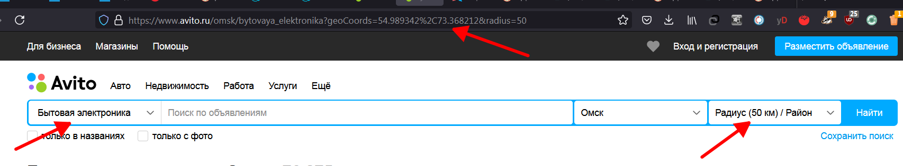

# Parser Avito
> parsing content from avito <br>
> built-in free **proxy** & **multithreading** <br>
> unloading to csv & json  

## What pulls
**product name | product price | product link** <br> 
does not collect personal information

## Installation
1. Clone repository
```bash
git clone link 
```
2. Use the package manager [pip](https://pip.pypa.io/en/stable/) to install dependencies
```bash
pip install -r requirements.txt 
```
## Usage
- Go to Avito, select: category and radius
  
- Copy resulting link 
- Run `parsing.py`
- Insert link and push Enter
- Get result in folder/dir `result`  